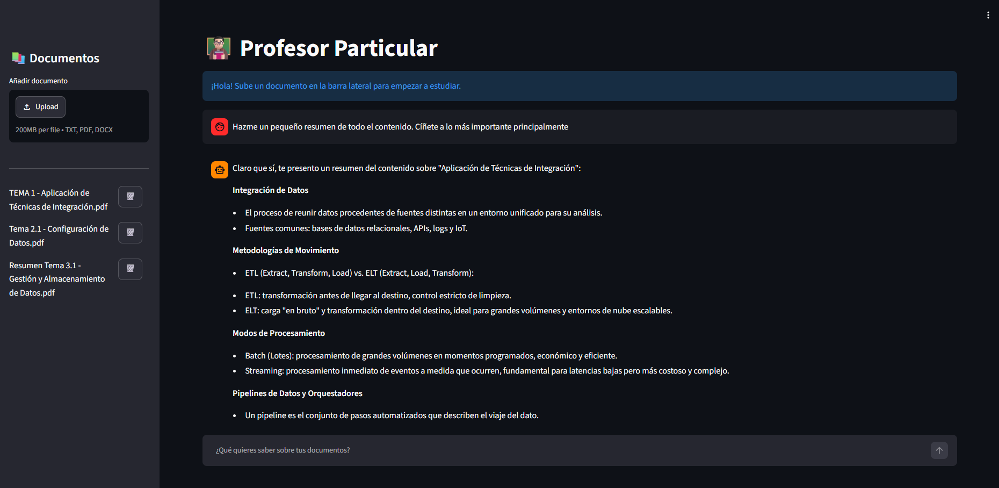

# 📚 Profesor IA: Analizador Inteligente de Documentos

Esta aplicación es un asistente educativo diseñado para leer, procesar y responder preguntas sobre tus documentos personales. Está optimizada para ofrecer una experiencia de usuario fluida, evitando instalaciones complejas de software externo y aprovechando la potencia de los modelos locales.

## 🚀 Características Principales

* **Zero-Install Philosophy:** No requiere configurar OCR externos (como Tesseract o Poppler) en el sistema operativo.
* **Procesamiento de Texto Nativo:** Utiliza PyMuPDF para una extracción rápida y precisa de texto desde documentos digitales.
* **Inteligencia Local:** Integración completa con Ollama para asegurar la privacidad de tus datos.
* **Arquitectura Limpia:** Estructura modular construida sobre LangChain y Streamlit.

## 🛠️ Requisitos del Sistema

Para ejecutar este proyecto, necesitas tener instalado:

1. Ollama (con el modelo llama3.2 descargado: `llama3.2 pull llama3.2`).
2. Python 3.10 o superior.

## ⚙️ Instalación

1. Clona el repositorio:

   `git clone [https://github.com/jmartinez-17/MiProfesorParticular.git]`

   `cd [MiProfesorParticular]`

2. Crea y activa tu entorno virtual:

   `python -m venv venv`

   `venv\Scripts\activate`

3. Instala las dependencias:

   `pip install -r requirements.txt`

## 🚀 Cómo ejecutarlo

Una vez instalado todo, simplemente lanza la aplicación:

`streamlit run app.py`

## 🔎 Vista Previa

## 📝 Notas sobre el Procesamiento de Documentos

Esta aplicación está optimizada para documentos digitales con texto seleccionable (PDFs generados desde Word, Google Docs, etc). Los documentos escaneados o imágenes sin capa de texto no son compatibles para mantener la ligereza y portabilidad de la herramienta.

## 🏗️ Historial de Evolución Técnica

Este proyecto ha sido optimizado iterativamente:

* **Fase de OCR (Descartada):** Se intentó la integración con Tesseract y Poppler para leer imágenes escaneadas. Se descartó por añadir complejidad innecesaria al usuario final.
* **Fase de Estabilización:** Se migró a PyMuPDF para una extracción de texto nativa, eliminando dependencias externas de sistema y errores de rutas.
* **Limpieza Final:** Se eliminaron dependencias obsoletas y se fijaron versiones exactas en requirements.txt para garantizar la reproducibilidad.